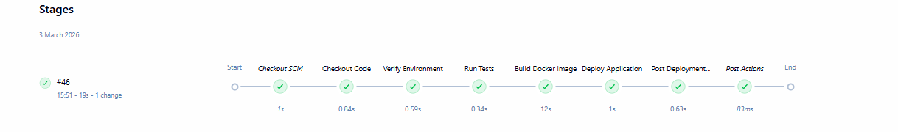
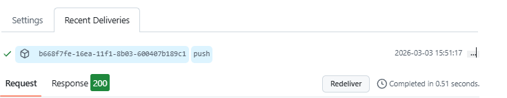
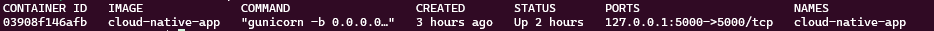
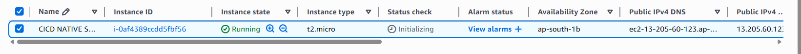
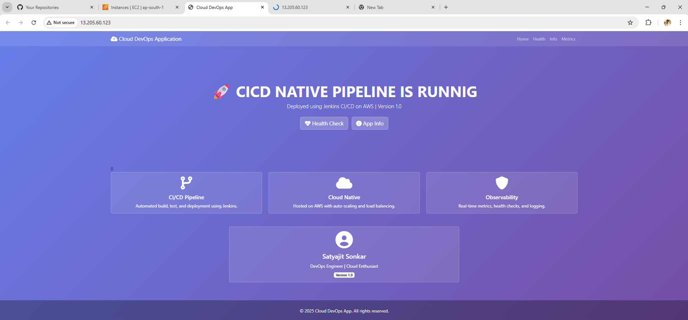

#  🚀 Cloud-Native CI/CD Pipeline Project on AWS

## 📌 Project Overview

This project demonstrates a complete end-to-end CI/CD pipeline for a Python-based web application using modern DevOps practices.

The application is built with Flask, containerized using Docker, automated using Jenkins, and deployed on AWS EC2 with Nginx reverse proxy and Gunicorn.

It showcases automated build, test, containerization, and live deployment triggered by every GitHub commit.

⸻

## 🛠️ Tech Stack
 - Python (Flask)
 - Gunicorn (WSGI Server)
 - Docker
 - Jenkins
 - Git & GitHub
 - AWS EC2 (Ubuntu)
 - Nginx (Reverse Proxy)
 - Linux (Ubuntu Server)

⸻

## 🏗️ Architecture Flow

1. Developed web application using Flask
2. Pushed source code to GitHub repository
3. Configured Jenkins pipeline on AWS EC2
4. Integrated GitHub Webhook for automatic triggering
5. Installed dependencies using virtual environments in CI
6. Built Docker image automatically via Jenkins
7. Replaced existing container on every build
8. Deployed application using Docker
9. Configured Nginx to reverse proxy traffic
10. Accessed application via EC2 Public IP / Domain

⸻

## 📂 Project Structure
```
Cloud-Native-CI-CD-Pipeline-on-AWS
│
├── app/
│   ├── main.py
│   └── test_app.py
│
├── screenshots/
│
├── Dockerfile
├── Jenkinsfile
├── config.py
├── requirements.txt
├── .gitignore
└── README.md                 # Project documentation|
```
⸻

## 🏛️ Deployment Architecture

Client (Browser) <br>
↓ <br>
EC2 Public IP / Domain <br>
↓ <br>
Nginx Reverse Proxy (Port 80) <br>
↓ <br>
Docker Container (Port 5000) <br>
↓ <br>
Gunicorn WSGI Server <br>
↓ <br>
Flask Application

⸻

## ☁️ Cloud Infrastructure
 - AWS EC2 (Ubuntu Server)
 - Jenkins installed on EC2
 - Docker Engine installed on EC2
 - Nginx configured as reverse proxy
 - GitHub Webhook for CI trigger

⸻

## 🚀 CI/CD Pipeline Stages

### 1. Checkout Code
Jenkins pulls the latest source code from the GitHub repository.

### 2. Install Dependencies
Creates a Python virtual environment and installs the required dependencies from `requirements.txt`.

### 3. Run Tests
Performs basic syntax validation by compiling the Python files.

### 4. Build Docker Image
Builds a Docker image for the application automatically.

### 5. Deploy Application
Stops the existing container (if running), removes the old container, and starts a new container using the latest Docker image.
⸻

## 🔄 Automatic Deployment

Every push to the **main branch** automatically triggers the deployment pipeline.

### Workflow

• GitHub sends a **webhook event** to Jenkins  
• Jenkins starts the **CI/CD pipeline**  
• A new **Docker image is built** from the updated code  
• The running container is **stopped and replaced**  
• The **latest version of the application is deployed automatically**

No manual server intervention is required.

⸻

## 🔍 Application Endpoint
      - `/` →→ Displays the application home page confirming successful deployment.

⸻
## 📸 CI/CD & Deployment Proof

### 🔁 Jenkins Pipeline

#### Jenkins Pipeline Success


#### GitHub Webhook Trigger Success


---

### 🐳 Docker Verification

#### Running Containers (docker ps)


---

### ☁️ AWS Infrastructure

#### EC2 Instance Running


---

### 🌐 Application Live (Nginx)

#### Live Application in Browser


---
## 📊 DevOps Concepts Implemented
 - Continuous Integration (CI)
 - Continuous Deployment (CD)
 - GitHub Webhooks
 - Pipeline Automation
 - Docker Containerization
 - Reverse Proxy Configuration
 - Production WSGI Server (Gunicorn)
 - Infrastructure Setup on AWS
 - Automated Container Replacement
 - Debugging using logs & systemctl
 - Nginx upstream configuration

⸻

## 🎯 Learning Outcomes

Through this project, I gained hands-on experience in:
 - Designing and implementing a complete CI/CD pipeline
 - Automating Docker builds using Jenkins
 - Integrating GitHub with Jenkins via Webhooks
 - Managing Linux servers on AWS EC2
 - Configuring Nginx as reverse proxy
 - Deploying production-ready Flask apps using Gunicorn
 - Handling real-world deployment errors (502, container conflicts, port issues)
 - Debugging Docker, Jenkins, and Nginx logs
 - Understanding full DevOps workflow from development to live deployment

⸻

## 👨‍💻 Author
```
Satyajit Sonkar
B.Sc Cloud Computing
DevOps & Cloud Engineering Enthusiast 🚀
```
